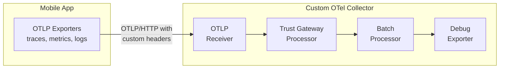

# custom-otel-collector

A custom OpenTelemetry Collector that acts as a trust gateway for mobile applications. It validates custom HTTP headers from client applications before exporting telemetry data to external systems.

## Features

- **Trust Gateway Processor**: Custom processor that validates HTTP headers and API keys
- **Header Validation**: Ensures required headers (`X-App-Token`, `X-API-Key`) are present
- **API Key Authentication**: Validates API keys against a configured whitelist
- **Containerized Deployment**: Docker support for easy deployment
- **Sample Mobile App**: JavaScript-based sample application demonstrating integration

## Architecture



## Components

### Custom Processor: Trust Gateway

The trust gateway processor (`processor/trustgatewayprocessor`) validates:
1. Required headers are present in resource attributes
2. API keys match the configured whitelist
3. Rejects telemetry data if validation fails

### Configuration

The collector is configured via `config.yaml`:

```yaml
processors:
  trustgateway:
    required_headers:
      - "X-App-Token"
    valid_api_keys:
      - "mobile-app-secret-key-123"
      - "mobile-app-secret-key-456"
```

## Building

### Prerequisites

- Go 1.24 or later
- Docker (for containerization)
- Node.js 20+ (for mobile app sample)

### Build the Collector

```bash
# Build locally
cd src/otel-collector
go build -o otelcol-custom .

# Build Docker image
cd src/otel-collector
docker build -t otelcol-custom .
```

## Running

### Option 1: Run Locally

```bash
# Start the collector
cd src/otel-collector
./otelcol-custom --config config.yaml
```

### Option 2: Run with Docker

```bash
# Build the image
cd src/otel-collector
docker build -t otelcol-custom .

# Run the container
docker run -p 4317:4317 -p 4318:4318 -p 13133:13133 otelcol-custom
```

### Option 3: Run with Docker Compose

```bash
cd src/otel-collector
docker-compose up
```

## Mobile App Sample

The `src/mobile-app` directory contains a Node.js application demonstrating how to send telemetry with custom headers.

### Setup Mobile App

```bash
cd src/mobile-app
npm install
```

### Run Mobile App

```bash
# With default settings
npm start

# With custom configuration
COLLECTOR_URL=http://localhost:4318 \
API_KEY=mobile-app-secret-key-123 \
APP_TOKEN=my-mobile-app-token \
npm start
```

### What the Mobile App Does

1. Initializes OpenTelemetry SDK with custom headers
2. Sets resource attributes including API key and app token
3. Sends sample traces and metrics to the collector
4. Demonstrates both valid and invalid authentication attempts

## Testing

### Test Valid Authentication

```bash
# Start the collector
cd src/otel-collector
./otelcol-custom --config config.yaml

# In another terminal, run the mobile app
cd src/mobile-app
npm start
```

You should see telemetry data being processed and logged by the collector.

### Test Invalid Authentication

Modify the mobile app to use an invalid API key:

```bash
API_KEY=invalid-key npm start
```

The collector will reject the telemetry data, and you'll see validation warnings in the collector logs.

## Configuration Options

### Collector Configuration

| Parameter | Description | Default |
|-----------|-------------|---------|
| `required_headers` | List of headers that must be present | `["X-App-Token"]` |
| `valid_api_keys` | Whitelist of valid API keys | `[]` |

### Mobile App Configuration

| Environment Variable | Description | Default |
|---------------------|-------------|---------|
| `COLLECTOR_URL` | OTel collector endpoint | `http://localhost:4318` |
| `API_KEY` | API key for authentication | `mobile-app-secret-key-123` |
| `APP_TOKEN` | Application token | `my-mobile-app-token` |

## Ports

| Port | Protocol | Description |
|------|----------|-------------|
| 4317 | gRPC | OTLP gRPC receiver |
| 4318 | HTTP | OTLP HTTP receiver |
| 13133 | HTTP | Health check endpoint |

## Development

### Project Structure

```
.
├── src/
│   ├── otel-collector/             # Custom collector
│   │   ├── main.go                 # Collector entry point
│   │   ├── config.yaml             # Collector configuration
│   │   ├── Dockerfile              # Docker build file
│   │   ├── processor/
│   │   │   └── trustgatewayprocessor/  # Custom processor
│   │   │       ├── config.go       # Processor configuration
│       ├── factory.go              # Processor factory
│       └── processor.go            # Processor logic
└── mobile-app/                      # Sample mobile application
    ├── package.json
    └── index.js                     # Mobile app code
```

### Adding New Processors

1. Create a new directory under `processor/`
2. Implement the processor interface
3. Add the processor to `main.go`
4. Update `config.yaml` with processor configuration

## Extending

### Adding More Exporters

To send data to external systems, add exporters to `main.go` and `config.yaml`:

```yaml
exporters:
  otlp:
    endpoint: "external-collector:4317"
    tls:
      insecure: false

service:
  pipelines:
    traces:
      receivers: [otlp]
      processors: [memory_limiter, trustgateway, batch]
      exporters: [debug, otlp]  # Add your exporter here
```

### Custom Validation Logic

Modify `processor/trustgatewayprocessor/processor.go` to add custom validation:

```go
func (p *trustGatewayProcessor) validateTelemetry(resources interface{}) error {
    // Add your custom validation logic here
    // For example: check IP allowlists, rate limiting, etc.
}
```

## Troubleshooting

### Collector not receiving data

1. Check that the collector is running: `curl http://localhost:13133`
2. Verify the mobile app is pointing to the correct URL
3. Check for firewall rules blocking ports 4317/4318

### Authentication failures

1. Verify the API key in the mobile app matches one in `valid_api_keys`
2. Check collector logs for validation warnings
3. Ensure custom headers are being sent (check network requests)

### Docker build fails

1. Ensure Go modules are properly initialized
2. Run `go mod tidy` before building
3. Check Docker daemon is running

## License

MIT License - see LICENSE file for details
