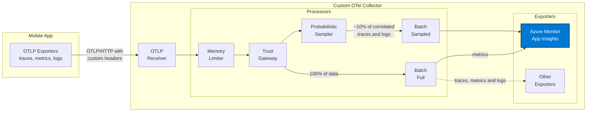

# OpenTelemetry Trust Gateway for Mobile Apps

Standard OpenTelemetry collectors don't validate source trustworthiness—critical for mobile apps vulnerable to emulator farms, device tampering, and token replay attacks.

This custom collector acts as a **trust gateway**—validating device attestations and cryptographic proofs in HTTP headers _before_ accepting telemetry and exporting to observability systems.

> [!WARNING]
> This project is **highly experimental** and under active development.

## Context & Assumptions

This guide assumes a scenario where device-bound security architecture is essential—such as financial services, healthcare, or any high-security mobile application where device identity is as critical as user identity.

The architecture model ensures every action or request is cryptographically tied to the physical device that generated it. Using hardware-anchored keys, a controlled device enrollment process, and continuous proof-of-possession (PoP) at invocation time, each request is individually signed. This ensures the backend can verify the device, prevent replay attacks, and detect tampering even if credentials or sessions are compromised.

> [!NOTE]
> The complete implementation of device enrollment with hardware-anchored public keys and request signature generation for proof-of-possession on the mobile app side is out of scope for this repository. This collector demonstrates the trust gateway validation pattern using **dummy header validations** as a simplified example of how device attestations would be verified.

## Features

- **Trust Gateway Processor**: Custom OpenTelemetry processor that validates device attestations through HTTP headers before accepting telemetry data
- **Header Validation**: Enforces presence of required headers (`X-App-Token`, `X-API-Key`) representing device identity claims
- **API Key Authentication**: Validates API keys against a configured whitelist to simulate device enrollment verification
- **Telemetry Rejection**: Automatically drops telemetry from unverified sources, preventing data pollution
- **Containerized Deployment**: Production-ready Docker and Docker Compose configurations
- **Kubernetes Ready**: Includes K8s deployment manifests for cloud-native environments
- **Sample Mobile App**: Reference Node.js application demonstrating proper integration patterns

## Architecture



## Components

### Custom Processor: Trust Gateway

The trust gateway processor (`processor/trustgatewayprocessor`) acts as a security checkpoint in the telemetry pipeline:

**Validation Steps:**

1. **Header Presence Check**: Verifies all required headers exist in resource attributes
2. **API Key Verification**: Validates the API key against a configured whitelist (simulating device enrollment database lookup)
3. **Telemetry Rejection**: Drops data from unverified sources with detailed logging for security audits

**How It Works:**

- Intercepts telemetry data at the processor stage (after receiver, before export)
- Extracts device identity claims from OTLP resource attributes
- In a production system, this would validate cryptographic signatures; here we use API keys for demonstration
- Failed validation prevents data from reaching exporters, reducing noise and potential security risks

### Collector Configuration

The collector is configured via `config.yaml`:

```yaml
processors:
  trustgateway:
    required_headers:
      - "X-App-Token"
    valid_api_keys:
      - "mobile-app-secret-key-123"
      - "mobile-app-secret-key-456"
```

## Prerequisites

- **Go 1.24 or later** - Required to build the collector from source
- **Docker & Docker Compose** (optional) - For containerized deployment
- **Node.js 20+** (optional) - Only needed to run the sample mobile app
- Azure Application Insights

## Getting Started

### Running Locally

Build the OTel Collector:

```bash
cd src/otel-collector
go build -o otelcol-custom .
```

Configure Azure Application Insights:

```bash
export APPLICATIONINSIGHTS_CONNECTION_STRING="InstrumentationKey=YOUR-KEY;IngestionEndpoint=https://..."
```

Run the Collector:

```bash
./otelcol-custom --config config.yaml
```

The collector will start and listen on the following ports:

- **4317** (OTLP gRPC)
- **4318** (OTLP HTTP)
- **13133** (Health check)

Verify it's running:

```bash
curl http://localhost:13133
```

### Running with Docker

Use Docker for a containerized deployment with easier configuration management.

Configure Azure Application Insights:

```bash
cd src/otel-collector

# Copy the example environment file
cp .env.example .env

# Edit .env and add your connection string
# APPLICATIONINSIGHTS_CONNECTION_STRING="InstrumentationKey=YOUR-KEY;IngestionEndpoint=https://..."
```

Build and Run with Docker Compose:

```bash
docker-compose up
```

Docker Compose will:

- Build the collector image
- Load environment variables from `.env` file
- Start the collector with proper port mappings
- Automatically restart on failure

Verify if it's running:

```bash
curl http://localhost:13133
```

## Mobile App Sample

The `src/mobile-app` directory contains a Node.js application demonstrating how to send telemetry with custom headers.

### Setup Mobile App

```bash
cd src/mobile-app
npm install
```

### Run Mobile App

```bash
# With default settings
npm start

# With custom configuration
COLLECTOR_URL=http://localhost:4318 \
API_KEY=mobile-app-secret-key-123 \
APP_TOKEN=my-mobile-app-token \
npm start
```

### What the Mobile App Does

1. **Initializes OpenTelemetry SDK**: Configures OTLP exporters for traces, metrics, and logs
2. **Sets Device Identity Attributes**: Attaches API key and app token as resource attributes (simulating device enrollment data)
3. **Generates Sample Telemetry**: Creates traces and metrics to demonstrate the full pipeline
4. **Tests Validation**: Demonstrates both valid (authorized) and invalid (rejected) scenarios
5. **Observability**: Shows how properly authenticated telemetry flows through the trust gateway

**Key Integration Patterns:**

- Custom resource attributes carry device identity claims
- HTTP headers are mapped to OTLP resource attributes
- Error handling demonstrates graceful degradation when validation fails

## Testing

### Test Valid Authentication

```bash
# Start the collector
cd src/otel-collector
./otelcol-custom --config config.yaml

# In another terminal, run the mobile app
cd src/mobile-app
npm start
```

You should see telemetry data being processed and logged by the collector.

### Test Invalid Authentication

Modify the mobile app to use an invalid API key:

```bash
API_KEY=invalid-key npm start
```

The collector will reject the telemetry data, and you'll see validation warnings in the collector logs.

## Configuration Options

### Collector Configuration

| Parameter          | Description                          | Default           |
| ------------------ | ------------------------------------ | ----------------- |
| `required_headers` | List of headers that must be present | `["X-App-Token"]` |
| `valid_api_keys`   | Whitelist of valid API keys          | `[]`              |

### Mobile App Configuration

| Environment Variable | Description                | Default                     |
| -------------------- | -------------------------- | --------------------------- |
| `COLLECTOR_URL`      | OTel collector endpoint    | `http://localhost:4318`     |
| `API_KEY`            | API key for authentication | `mobile-app-secret-key-123` |
| `APP_TOKEN`          | Application token          | `my-mobile-app-token`       |

## Ports

| Port  | Protocol | Description           |
| ----- | -------- | --------------------- |
| 4317  | gRPC     | OTLP gRPC receiver    |
| 4318  | HTTP     | OTLP HTTP receiver    |
| 13133 | HTTP     | Health check endpoint |

## Development

### Project Structure

```
.
├── src/
│   ├── otel-collector/             # Custom collector
│   │   ├── main.go                 # Collector entry point
│   │   ├── config.yaml             # Collector configuration
│   │   ├── Dockerfile              # Docker build file
│   │   ├── processor/
│   │   │   └── trustgatewayprocessor/  # Custom processor
│   │   │       ├── config.go       # Processor configuration
│       ├── factory.go              # Processor factory
│       └── processor.go            # Processor logic
└── mobile-app/                      # Sample mobile application
    ├── package.json
    └── index.js                     # Mobile app code
```

### Adding New Processors

1. **Create Processor Directory**: `mkdir -p processor/myprocessor`
2. **Implement Required Files**:
   - `config.go`: Define configuration struct
   - `factory.go`: Implement processor factory interface
   - `processor.go`: Core processing logic
3. **Register in Collector**: Import and add to builder in `main.go`
4. **Configure Pipeline**: Add processor to `config.yaml` service pipelines
5. **Test**: Write unit tests and integration tests

**Example:**

```go
// In main.go
import "custom-otel-collector/processor/myprocessor"

// Add to WithProcessors
.WithProcessors(
    myprocessor.NewFactory(),
    // ... other processors
)
```

## Extending

### Adding More Exporters

To send data to external systems, add exporters to `main.go` and `config.yaml`:

```yaml
exporters:
  otlp:
    endpoint: "external-collector:4317"
    tls:
      insecure: false

service:
  pipelines:
    traces:
      receivers: [otlp]
      processors: [memory_limiter, trustgateway, batch]
      exporters: [debug, otlp] # Add your exporter here
```

### Custom Validation Logic

Modify `processor/trustgatewayprocessor/processor.go` to add custom validation:

```go
func (p *trustGatewayProcessor) validateTelemetry(resources interface{}) error {
    // Add your custom validation logic here
    // For example: check IP allowlists, rate limiting, etc.
}
```

## Troubleshooting

### Collector not receiving data

1. Check that the collector is running: `curl http://localhost:13133`
2. Verify the mobile app is pointing to the correct URL
3. Check for firewall rules blocking ports 4317/4318

### Authentication failures

1. Verify the API key in the mobile app matches one in `valid_api_keys`
2. Check collector logs for validation warnings
3. Ensure custom headers are being sent (check network requests)

### Docker build fails

1. Ensure Go modules are properly initialized
2. Run `go mod tidy` before building
3. Check Docker daemon is running
