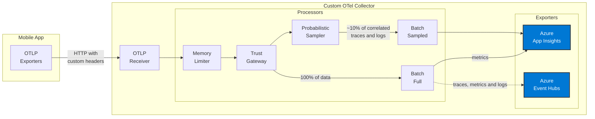

# Secure Observability for Mobile Apps at Scale

This repo showcases a telemetry data pipeline architecture that combines **security validation**, **intelligent sampling**, and **cost-effective observability** for high-volume mobile applications.

## Why This Matters

Mobile apps face unique observability challenges that traditional collectors don't address:

1. **Security Risk**: Standard collectors accept telemetry from any source—leaving you vulnerable to emulator farms, device tampering, and fraudulent data pollution
2. **Volume & Cost**: Millions of mobile devices generate massive telemetry volumes, making cloud ingestion costs spiral out of control
3. **Lost Context**: Basic sampling can break trace-log correlation, making troubleshooting impossible

## What This Provides

This architecture focus on solving those three problems:

- **🔒 Trust Gateway**: Validates device identity and authenticity before accepting any telemetry
- **📊 Intelligent Sampling**: Configurable sampling data for cost reduction while maintaining correlated traces and logs
- **⚡ Scalability**: Handles millions of spans per day with predictable costs and complete observability
- **🌊 Event Streaming**: Real-time telemetry streaming to Azure Event Hubs for event-driven architectures and analytics
- **🌐 Vendor Neutrality**: Built on OpenTelemetry standard, avoiding vendor lock-in and seamlessly switch or add observability backends

> [!WARNING]
> This project is **highly experimental** and under active development.

## Architecture Philosophy

This solution is designed for **high-security, high-volume mobile applications**, common in financial services, healthcare, or any scenario where device identity is as critical as user identity.

**Core Principles:**

- Every telemetry data point is cryptographically tied to a verified physical device
- Sampling decisions maintain trace-log correlation for effective debugging
- Cost control through intelligent routing: sampled data to expensive storage, full data to cost-effective destinations
- Zero-trust approach: validate first, ingest second

> [!NOTE]
> The complete implementation of device enrollment with hardware-anchored public keys and request signature generation for proof-of-possession on the mobile app side is out of scope for this repository. This collector demonstrates the trust gateway validation pattern using **dummy header validations** as a simplified example of how device attestations would be verified.

## Features

### Security & Trust

- **Trust Gateway Processor**: Custom OpenTelemetry processor that validates device attestations through HTTP headers before accepting telemetry data
- **Header Validation**: Enforces presence of required headers (`X-App-Token`, `X-API-Key`) representing device identity claims
- **API Key Authentication**: Validates API keys against a configured whitelist to simulate device enrollment verification
- **Telemetry Rejection**: Automatically drops telemetry from unverified sources, preventing data pollution

### Scalability & Cost Control

- **Probabilistic Sampling**: Intelligent sampling strategy (10% configurable) for high-volume trace and log data
- **Correlated Sampling**: Traces and logs are sampled together using trace_id to maintain observability context
- **Selective Metrics**: Full metrics collection (no sampling) for accurate dashboards and alerting
- **Multi-Pipeline Architecture**: Separate pipelines for sampled data (cost-effective cloud storage) and full data (comprehensive analysis)
- **Volume Management**: Designed to handle millions of spans per day while controlling cloud ingestion costs

### Event Streaming & Analytics

- **Azure Event Hubs Exporter**: Custom exporter streaming telemetry data to Azure Event Hubs
- **Real-time Processing**: Event Hubs enables real-time stream processing and event-driven architectures
- **Parquet Format Support**: Exporter supports Parquet format with Snappy compression for efficient data serialization
- **Optional Data Lake Integration**: Configure Event Hubs Capture for automatic archival to Azure Data Lake Storage Gen2
- **Analytics Ready**: Captured data accessible by Azure Synapse, Databricks, Spark for advanced analytics

### Deployment & Integration

- **Containerized Deployment**: Production-ready Docker and Docker Compose configurations
- **Kubernetes Ready**: Includes K8s deployment manifests for cloud-native environments
- **Azure Application Insights**: Pre-configured for Azure Monitor integration with sampling
- **Extensible Design**: Ready to add multiple exporters with different sampling strategies
- **Sample Mobile App**: Reference Node.js application generating 1000 activities with correlated traces and logs

## Architecture



> [!NOTE]
> **Optional Data Lake Integration**: Azure Event Hubs can be configured with [Event Hubs Capture](https://docs.azure.cn/en-us/event-hubs/event-hubs-capture-overview) to automatically archive raw telemetry data to Azure Data Lake Storage Gen2 for long-term retention and analytics.

## Components

### Custom Processor: Trust Gateway

The trust gateway processor (`processor/trustgatewayprocessor`) acts as a security checkpoint in the telemetry pipeline:

**Validation Steps:**

1. **Header Presence Check**: Verifies all required headers exist in resource attributes
2. **API Key Verification**: Validates the API key against a configured whitelist (simulating device enrollment database lookup)
3. **Telemetry Rejection**: Drops data from unverified sources with detailed logging for security audits

**How It Works:**

- Intercepts telemetry data at the processor stage (after receiver, before export)
- Extracts device identity claims from OTLP resource attributes
- In a production system, this would validate cryptographic signatures; here we use API keys for demonstration
- Failed validation prevents data from reaching exporters, reducing noise and potential security risks

### Sampling Strategy for Scale

The collector implements a sophisticated sampling strategy designed to handle large volumes of telemetry data while controlling costs:

#### How It Works

**Multiple Pipelines with Different Strategies:**

1. **Sampled Pipeline (Traces + Logs)** → Azure Application Insights
   - 10% probabilistic sampling (configurable)
   - Traces and logs are **correlated** via `trace_id`
   - When a trace is sampled, all its logs are kept together
   - Perfect for cost-effective cloud storage while maintaining visibility

2. **Full Pipeline (Metrics)** → Azure Application Insights
   - 100% of metrics sent (no sampling)
   - Critical for accurate dashboards, alerts, and SLOs
   - Metrics typically have lower volume than traces/logs

3. **Full Data Pipeline** → Azure Event Hubs
   - Send 100% of all telemetry (traces, logs, metrics) to Azure Event Hubs
   - Real-time event streaming for downstream processing and analytics
   - Data exported in Parquet format with Snappy compression
   - Optional: Enable Event Hubs Capture to automatically archive to Azure Data Lake Storage Gen2

#### Key Design Principles

- **Correlation**: Logs inherit `trace_id` from their parent spans, ensuring sampling keeps related data together
- **Flexibility**: Different sampling rates per pipeline - aggressive for traces/logs, none for metrics
- **Multi-Destination**: Send sampled data to Application Insights for real-time monitoring, full data to Event Hubs for stream processing
- **Cost Control**: Handle millions of events per day while keeping cloud ingestion costs predictable
- **Observability**: 10% sampling still provides statistical significance for most use cases
- **Event Streaming**: Event Hubs enables real-time analytics, event-driven architectures, and optional data lake archival

## Prerequisites

- **Go 1.24 or later** - Required to build the collector from source
- **Docker & Docker Compose** (optional) - For containerized deployment
- **Node.js 20+** (optional) - Only needed to run the sample mobile app
- **Azure Application Insights** for sampled telemetry data
- **Azure Event Hubs** for streaming full telemetry data

## Getting Started

### Running from source

Build the OTel Collector:

```bash
cd src/otel-collector
go build -o otelcol-custom .
```

Configure environment variables:

```bash
# Required: Azure Application Insights connection string
export APPLICATIONINSIGHTS_CONNECTION_STRING="InstrumentationKey=YOUR-KEY;IngestionEndpoint=https://..."

# Required: Azure Event Hubs namespace URL (for managed identity/service principal auth)
export EVENTHUBS_NAMESPACE_URL="https://YOUR-NAMESPACE.servicebus.windows.net"

# Optional: For Event Hubs connection string authentication (alternative to managed identity)
# export EVENTHUBS_CONNECTION_STRING="Endpoint=sb://YOUR-NAMESPACE.servicebus.windows.net/;SharedAccessKeyName=...;SharedAccessKey=..."

# Optional: For Azure DefaultAzureCredential (service principal)
# export AZURE_TENANT_ID="your-tenant-id"
# export AZURE_CLIENT_ID="your-client-id"
# export AZURE_CLIENT_SECRET="your-client-secret"
```

Run the Collector:

```bash
./otelcol-custom --config config.yaml
```

The collector will start and listen on the following ports:

- **4317** (OTLP gRPC)
- **4318** (OTLP HTTP)
- **13133** (Health check)

Verify it's running:

```bash
curl http://localhost:13133
```

### Running with Docker

Use Docker for a containerized deployment with easier configuration management.

Configure environment variables:

```bash
cd src/otel-collector

# Copy the example environment file
cp .env.example .env

# Edit .env and add your configuration:
# APPLICATIONINSIGHTS_CONNECTION_STRING="InstrumentationKey=YOUR-KEY;IngestionEndpoint=https://..."
# EVENTHUBS_NAMESPACE_URL="https://YOUR-NAMESPACE.servicebus.windows.net"
# 
# Optional: For connection string auth instead of managed identity
# EVENTHUBS_CONNECTION_STRING="Endpoint=sb://YOUR-NAMESPACE.servicebus.windows.net/;SharedAccessKeyName=...;SharedAccessKey=..."
#
# Optional: For service principal authentication
# AZURE_TENANT_ID="your-tenant-id"
# AZURE_CLIENT_ID="your-client-id"
# AZURE_CLIENT_SECRET="your-client-secret"
```

Build and Run with Docker Compose:

```bash
docker-compose up
```

Docker Compose will:

- Build the collector image
- Load environment variables from `.env` file
- Start the collector with proper port mappings
- Automatically restart on failure

Verify if it's running:

```bash
curl http://localhost:13133
```

## Mobile App Sample

The `src/mobile-app` directory contains a Node.js application demonstrating how to send telemetry with custom headers.

### Setup Mobile App

```bash
cd src/mobile-app
npm install
```

### Run Mobile App

```bash
# With default settings
npm start

# With custom configuration
COLLECTOR_URL=http://localhost:4318 \
API_KEY=mobile-app-secret-key-123 \
APP_TOKEN=my-mobile-app-token \
npm start
```

### What the Mobile App Does

1. **Initializes OpenTelemetry SDK**: Configures OTLP exporters for traces, metrics, and logs
2. **Sets Device Identity Attributes**: Attaches API key and app token as resource attributes (simulating device enrollment data)
3. **Generates Sample Telemetry**: Creates traces and metrics to demonstrate the full pipeline
4. **Tests Validation**: Demonstrates both valid (authorized) and invalid (rejected) scenarios
5. **Observability**: Shows how properly authenticated telemetry flows through the trust gateway

**Key Integration Patterns:**

- Custom resource attributes carry device identity claims
- HTTP headers are mapped to OTLP resource attributes
- Error handling demonstrates graceful degradation when validation fails

## Testing

### Test Valid Authentication

```bash
# Start the collector
cd src/otel-collector
./otelcol-custom --config config.yaml

# In another terminal, run the mobile app
cd src/mobile-app
npm start
```

You should see telemetry data being processed and logged by the collector.

### Test Invalid Authentication

Modify the mobile app to use an invalid API key:

```bash
API_KEY=invalid-key npm start
```

The collector will reject the telemetry data, and you'll see validation warnings in the collector logs.

## Configuration Options

### Collector Configuration

| Parameter          | Description                          | Default           |
| ------------------ | ------------------------------------ | ----------------- |
| `required_headers` | List of headers that must be present | `["X-App-Token"]` |
| `valid_api_keys`   | Whitelist of valid API keys          | `[]`              |

### Mobile App Configuration

| Environment Variable | Description                | Default                     |
| -------------------- | -------------------------- | --------------------------- |
| `COLLECTOR_URL`      | OTel collector endpoint    | `http://localhost:4318`     |
| `API_KEY`            | API key for authentication | `mobile-app-secret-key-123` |
| `APP_TOKEN`          | Application token          | `my-mobile-app-token`       |

## Ports

| Port  | Protocol | Description           |
| ----- | -------- | --------------------- |
| 4317  | gRPC     | OTLP gRPC receiver    |
| 4318  | HTTP     | OTLP HTTP receiver    |
| 13133 | HTTP     | Health check endpoint |

## Development

### Adding New Processors

1. **Create Processor Directory**: `mkdir -p processor/myprocessor`
2. **Implement Required Files**:
   - `config.go`: Define configuration struct
   - `factory.go`: Implement processor factory interface
   - `processor.go`: Core processing logic
3. **Register in Collector**: Import and add to builder in `main.go`
4. **Configure Pipeline**: Add processor to `config.yaml` service pipelines
5. **Test**: Write unit tests and integration tests

**Example:**

```go
// In main.go
import "custom-otel-collector/processor/myprocessor"

// Add to WithProcessors
.WithProcessors(
    myprocessor.NewFactory(),
    // ... other processors
)
```

## Extending

### Adding More Exporters

To send data to external systems, add exporters to `main.go` and `config.yaml`:

```yaml
exporters:
  otlp:
    endpoint: "external-collector:4317"
    tls:
      insecure: false

service:
  pipelines:
    traces:
      receivers: [otlp]
      processors: [memory_limiter, trustgateway, batch]
      exporters: [debug, otlp] # Add your exporter here
```

### Custom Validation Logic

Modify `processor/trustgatewayprocessor/processor.go` to add custom validation:

```go
func (p *trustGatewayProcessor) validateTelemetry(resources interface{}) error {
    // Add your custom validation logic here
    // For example: check IP allowlists, rate limiting, etc.
}
```

## Troubleshooting

### Collector not receiving data

1. Check that the collector is running: `curl http://localhost:13133`
2. Verify the mobile app is pointing to the correct URL
3. Check for firewall rules blocking ports 4317/4318

### Authentication failures

1. Verify the API key in the mobile app matches one in `valid_api_keys`
2. Check collector logs for validation warnings
3. Ensure custom headers are being sent (check network requests)

### Docker build fails

1. Ensure Go modules are properly initialized
2. Run `go mod tidy` before building
3. Check Docker daemon is running
